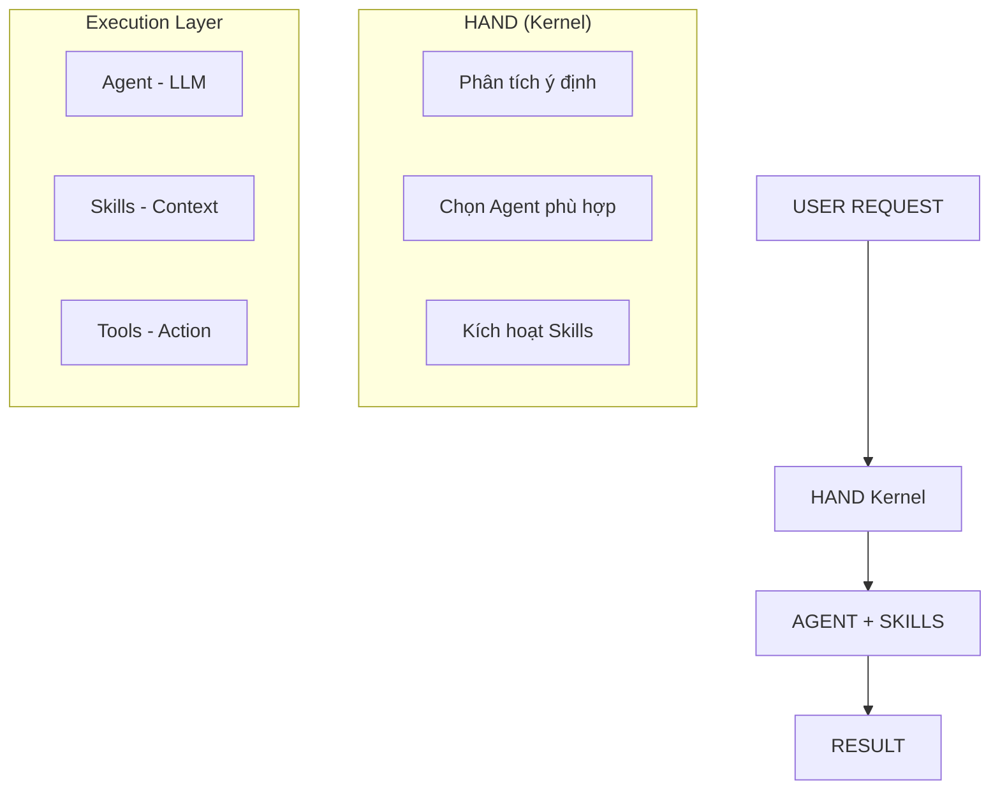

# 🎯 SKILL LÀ GÌ TRONG OPENFANG?

## 1. ĐỊNH NGHĨA CƠ BẢN
Skill (Kỹ năng) trong OpenFang là gói công cụ chuyên biệt được thiết kế để giúp Agent thực hiện các tác vụ cụ thể trong một lĩnh vực nhất định.

**So sánh dễ hiểu:**

| Khái niệm | Ví dụ thực tế | Trong OpenFang |
| :--- | :--- | :--- |
| **Agent** | Một nhân viên | `assistant`, `coder`, `researcher` |
| **Skill** | Chuyên môn của nhân viên | `python-expert`, `aws`, `docker` |
| **Tool** | Công cụ nhân viên dùng | `file_read`, `shell_exec`, `web_fetch` |
| **Hand** | Bộ não điều khiển | Kernel điều phối Agent + Skills |

---

## 2. CƠ CHẾ HOẠT ĐỘNG
### 📐 Kiến trúc 3 lớp:



1.  **HAND (Kernel)**: Nhận request, phân tích intent, chọn Agent và kích hoạt Skills.
2.  **AGENT + SKILLS**: Agent (LLM) suy nghĩ, Skills cung cấp chuyên môn, Tools thực thi.
3.  **EXECUTION**: Trả kết quả về cho người dùng.

---

## 3. MỘT SKILL BAO GỒM NHỮNG GÌ?
Mỗi Skill là một package có cấu trúc rõ ràng:

```text
~/.openfang/skills/<skill-name>/
├── SKILL.md           # Documentation cho người dùng
├── SKILL.toml         # Manifest (metadata, config)
├── tools/             # Các tools đặc thù của skill
│   ├── tool_1.md
│   ├── tool_2.md
│   └── ...
└── examples/          # Ví dụ sử dụng
```

### 📄 SKILL.toml (Manifest):
```toml
name = "python-expert"
version = "1.0.0"
category = "programming"
description = "Python programming expert for stdlib, packaging, type hints, async/await"

# Tools mà skill này cung cấp
tools = ["file_read", "shell_exec", "web_fetch"]

# System prompt bổ sung
system_prompt = """
You are a Python expert. You help users with:
- Standard library usage
- Package management (pip, poetry, uv)
- Type hints and pydantic
- Async/await patterns
"""
```

---

## 4. CƠ CHẾ KÍCH HOẠT SKILL
*   **Auto-detection (Tự động)**: Agent tự nhận diện từ khóa (ví dụ: "Python", "AWS").
*   **Explicit activation (Chủ động)**: Người dùng yêu cầu (ví dụ: "Dùng skill aws...").
*   **Hand config (Cấu hình sẵn)**: Gán sẵn trong file cấu hình của Hand.

---

## 5. PHÂN LOẠI SKILLS
OpenFang có **61 skills** chia thành các nhóm:

*   ☁️ **Cloud & DevOps**: aws, gcp, docker, kubernetes, terraform...
*   💻 **Programming**: python-expert, typescript-expert, react-expert...
*   🗄️ **Database**: postgres-expert, mysql-expert, mongodb, redis...
*   🔒 **Security**: security-audit, oauth-expert, crypto-expert...
*   📊 **Data & ML**: data-analyst, ml-engineer, sql-analyst...
*   📝 **Writing**: technical-writer, email-writer, writing-coach...
*   🛠️ **Platforms**: git-expert, github, jira, slack-tools...

---

## 6. LỢI ÍCH CỦA SKILL SYSTEM
*   **Modular**: Độc lập, dễ quản lý.
*   **Composable**: Kết hợp nhiều kỹ năng cho tác vụ phức tạp.
*   **Specialized**: Chuyên sâu trong từng lĩnh vực.
*   **Extensible**: Có thể tự tạo skill custom.

---

## 7. TÓM TẮT
> **Agent (não) + Skills (chuyên môn) = Super Agent 🚀**

Skill cung cấp "chuyên môn" và "công cụ" để Agent không chỉ biết nói mà còn biết làm (Actionable AI).
